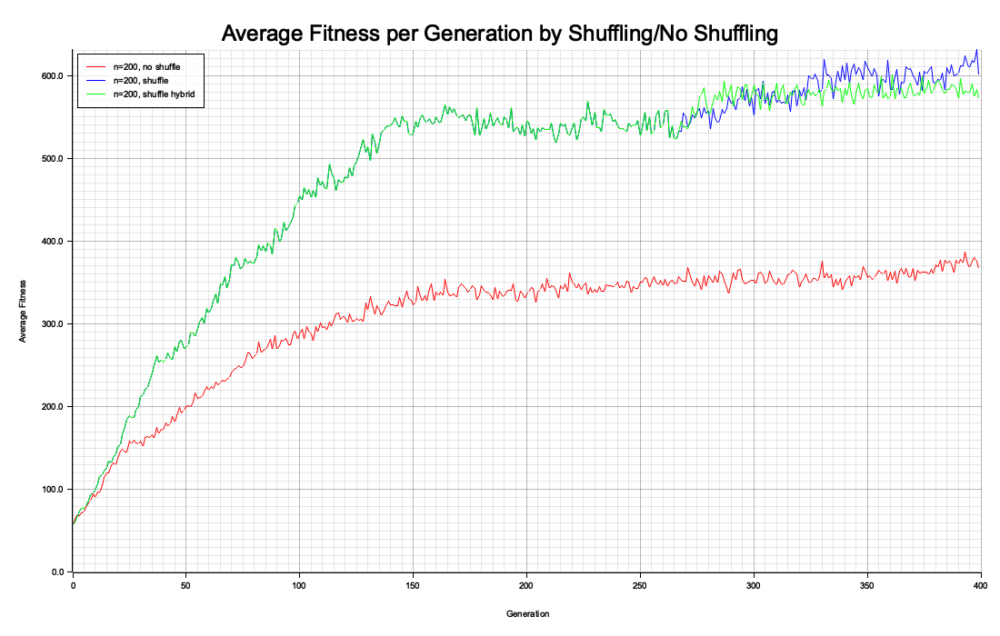

## Introduction
This post serves to chronicle my Boggle project, which I have been working on intermittently since January. For those who are unfamiliar, Boggle is a word game in which cubes with a letter on each face are distributed randomly over a square grid, in which players look for words formed by adjacent letters. After a specified period of time, players compare their word lists and receive points for all unique words. Boggle comes in three sizes: 
* Boggle, which is a 4-by-4 grid
* Big Boggle, which is a 5-by-5 grid
* Super Big Boggle, which is a 6-by-6 grid

I personally prefer Big Boggle. Thus, for the rest of this post, when I refer to "Boggle", I actually mean the 5-by-5 Big Boggle. 

## Python Attempt

Last January, I was curious about how many words are contained in a typical Boggle board that aren't found by players. This inspired me to write a program to solve a Boggle board, which took as input a configuration of letters and returned the words present. Having only taken one introductory programming class at this time, the result was a poorly structured Python implementation that did what it was supposed to do, but barely. I got the solve time down to somewhere around 10 miliseconds, which was then satisfactory, using a tortured method that checked adjacent letters in the board against 15 hash maps containing prefixes of dictionary words. Using this program, I ran 300,000 trials of random boards using the standard set of cubes from my copy of Boggle. From these trials, I computed the following summary statistics:
* Mean: 335.63 points
* SD: 198.26 points
* 99% Confidence Interval for mean: (334.70, 336.56)
* Distinct words found: 103,416
* Minimum points: 4
* Maximum points: 2216

My next thought was that with this program in hand, I could try to create a better set of letter cubes than the ones shipped with standard Boggle. My idea of "better" at this time was simply that a set of cubes that results in higher scores for players is more fun, so a "better" set of cubes is one that contains the most points on average. In pursuit of this goal, I implemented a genetic algorithm that did successfully optimize sets of Boggle cubes according to a given fitness function, with two caveats:
* It was incredibly slow; I would often have to run the program overnight to reach the desired results.
* It is hard to choose a fitness function that faithfully evaluates whether or not a set of cubes is good for gameplay. Functions that seem reasonable on face value often end up optimized to undesirable extremes.

The first point was annoying but not insurmountable. The second point foreshadows the comical death of the idea that "better" is equivalent to scoring more points. When I ran my optimizer trying to find a set of cubes that maximizes total points, I received this in return:
* Mean: 625.50
* SD: 327.43
* 99% confidence interval for mean: (623.96, 627.04)
* Distinct words found: 93,466
* Minimum points: 2
* Maximum points: 3610

The first red flag of this high-scoring set is that the number of distinct words found in 300k trials is substantially lower than the number of distinct words found in 300k trials with the standard set.

## Revisiting in Rust
In the time since shelving the Python version, I've completed two CS courses: one on data structures and one covering assorted low-level topics including assembly language, hardware, C, and most importantly for this project, parallelism. The performance benefits of C over Python that this class demonstrated to me that it was necessary to rewrite the Boggle project in a more performant language. My previous experience in Rust combined with the fact that I do not enjoy programming in C made it an easy choice. The parallelism content provided a way to improve performance even more. As anticipated, the results were excellent. This new version takes around 370 *microseconds* on average to randomize and solve one board. Because I don't have exact benchmarks for the Python version, it's hard to say exactly how many times faster the Rust version is, but the speedup between the two versions is somewhere between 25 and 40 times. The promise of this, of course, is the ability to run better, longer, and more simulations in the quest to optimize Boggle.

### Genetic Algorithm Improvements
Once my Rust Boggle program was up and running, I ran the same total points optimization that produced unsatisfactory cubes in the Python version. This was simply to provide informal benchmarks for the performance of the new version. As shown in the following image, I found that 1000 generations with a population size of 1000 was sufficient to achieve the same maximum in the neighborhood of 600-650 points on average. However, it must be noted that this is incredibly computationally intensive, despite being immensely faster in Rust. To evaluate each cube set under this fitness function, we run it 5 times and average the total points per round. This is repeated 1000 times each generation (once for each member of the population) for 1000 generations. Thus, we see we are simulating a ridiculous *5 million* games of Boggle to complete the desired optimization. 

Ideally, we would like to reduce the population size, number of generations, or both, while still reliably reaching the global maximum (I understand it is possible that the algorithm is converging to a local maximum without me knowing, but I doubt this given how the sets produced tend to have all but optimized out most letters). As the following graph demonstrates (n=200, no shuffling), the issue that one encounters when using a population size that is too small is premature convergence to a local maximum. The issue with running the algorithm for too few generations is obvious: you may turn off the optimizer before it reaches the optimum. I decided to approach problem from the population size perspective. In some way, the premature convergence to a local maximum seems to occur due to the algorithm not exploring enough of the space, or because of limited genetic diversity in the initial random population. Then, we can circumvent premature convergence by introducing additional randomness to the population throughout the progress of the algorithm. My idea to do this was to instead of copying over genomes not selected for crossover or mutation exactly between generations, I would shuffle them, taking advantage of the useful property of Boggle cube sets that their most important attribute is the distribution of letters, regardless of how they are placed on cubes. This means that a permutation of a good cube set is likely to also be fairly good. This is much more computationally efficient than carrying extra population members throughout every generation.

With the new and improved genetic algorithm in hand, I finally returned to the original task of optimizing Boggle.

## Findings

