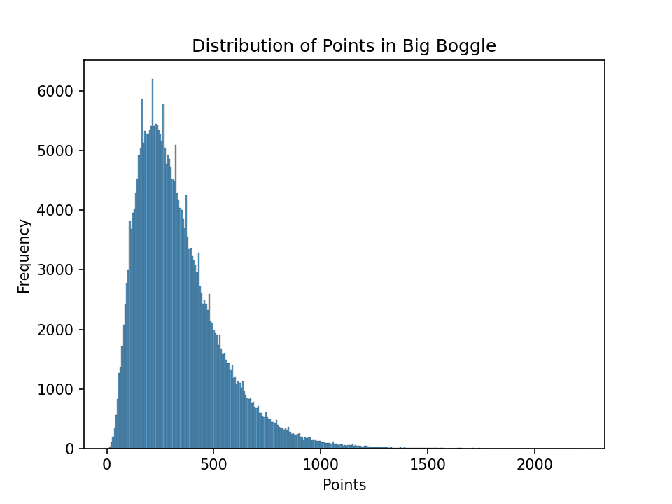
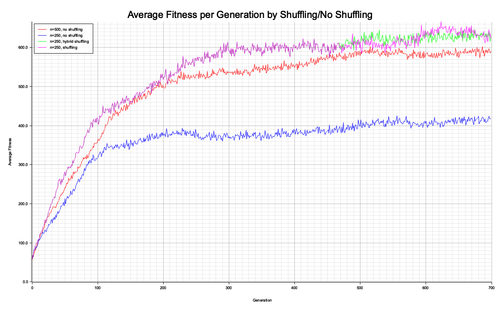

## Introduction
This post serves to chronicle my Boggle project, which I have been working on intermittently since January. It is mostly complete, but I hope to add later more detailed data of simulations of many Boggle games, including word frequencies. For those who are unfamiliar, Boggle is a word game in which cubes with a letter on each face are distributed randomly over a square grid, in which players look for words formed by adjacent letters. After a specified period of time, players compare their word lists and receive points for all unique words. Boggle comes in three sizes: 
* Boggle, which is a 4-by-4 grid
* Big Boggle, which is a 5-by-5 grid
* Super Big Boggle, which is a 6-by-6 grid

I personally prefer Big Boggle. Thus, for the rest of this post, when I refer to "Boggle", I actually mean the 5-by-5 Big Boggle. 

## Python Attempt

Last January, I was curious about how many words are contained in a typical Boggle board that aren't found by players. This inspired me to write a program to solve a Boggle board, which took as input a configuration of letters and returned the words present. Having only taken one introductory programming class at this time, the result was a poorly structured Python implementation that did what it was supposed to do, but barely. I got the solve time down to somewhere around 10 miliseconds, which was then satisfactory, using a tortured method that checked adjacent letters in the board against 15 hash maps containing prefixes of dictionary words. Using this program, I ran 300,000 trials of random boards using the standard set of cubes from my copy of Boggle. From these trials, I computed the following summary statistics:
* Mean: 335.63 points
* SD: 198.26 points
* 99% Confidence Interval for mean: (334.70, 336.56)
* Distinct words found: 103,416
* Minimum points: 4
* Maximum points: 2216

My next thought was that with this program in hand, I could try to create a better set of letter cubes than the ones shipped with standard Boggle. My idea of "better" at this time was simply that a set of cubes that results in higher scores for players is more fun, so a "better" set of cubes is one that contains the most points on average. In pursuit of this goal, I implemented a genetic algorithm that did successfully optimize sets of Boggle cubes according to a given fitness function, with two caveats:
* It was incredibly slow; I would often have to run the program overnight to reach the desired results.
* It is hard to choose a fitness function that faithfully evaluates whether or not a set of cubes is good for gameplay. Functions that seem reasonable on face value often end up optimized to undesirable extremes.

The first point was annoying but not insurmountable. The second point foreshadows the amusing death of the idea that "better" is equivalent to scoring more points. When I ran my optimizer trying to find a set of cubes that maximizes total points, I received this in return:
* Mean: 625.50
* SD: 327.43
* 99% confidence interval for mean: (623.96, 627.04)
* Distinct words found: 93,466
* Minimum points: 2
* Maximum points: 3610

The first red flag of this high-scoring set is that the number of distinct words found in 300k trials is substantially lower than the number of distinct words found in 300k trials with the standard set. Inspecting the cubes reveals why. The high scoring set has 27 instances of the letter 'e' and 21 of the letter 's' out of 150 slots, as opposed to 19 and 9 respectively in the standard set. To make room for this, the high scoring set has only one instance the following letters: B, F, H, J, K, Q, V, W, X, Y, Z, and only two of G and M. Thus, this set sacrifices diversity of words and representative-ness of letter frequencies in English in return for long words derived from plurals. As a note, I believe that this high scoring cube set is likely close to the global maximum because of how many letters have been optimized out as much as they can be while staying within the bounds of legality, where the only constraint I require of a cube set to be legal is that each letter is represented at least once. 

At this point, I was stuck. Each run of the genetic algorithm took hours, so I couldn't experiment freely, and I didn't have much idea of what "better" meant other than that it should retain more variety of letters than this first attempt. As a result, I shelved the project.

## Revisiting in Rust
In the time since setting aside the Python version, I've completed two CS courses: one on data structures and one covering assorted low-level topics including assembly language, computer architecture, C, and most importantly for this project, parallelism. The performance benefits of C over Python that this class demonstrated to me that it was necessary to rewrite the Boggle project in a more performant language. My previous experience in Rust combined with the fact that I do not enjoy programming in C made it an easy choice. The parallelism content provided a way to improve performance even more. As anticipated, the results were excellent. This new version takes around 370 *microseconds* on average to randomize and solve one board. Because I don't have exact benchmarks for the Python version, it's hard to say exactly how many times faster the Rust version is, but the speedup between the two versions is somewhere between 25 and 40 times. The promise of this, of course, is the ability to run better, longer, and more simulations to optimize Boggle.

### Genetic Algorithm Improvements
Once my Rust Boggle program was up and running, I ran the same total points optimization that produced unsatisfactory cubes in the Python version. This was simply to provide informal benchmarks for the performance of the new version. I found that running 1000 generations with a population size of 1000 was sufficient to achieve the same maximum in the neighborhood of 600-650 points on average. However, it must be noted that doing so is still computationally intensive, despite being immensely faster using the new Rust version. To evaluate each cube set under this fitness function, we run it 5 times and average the total points per round. This is repeated 1000 times each generation (once for each member of the population) for 1000 generations. Thus, we see we are simulating a ridiculous *5 million* games of Boggle to complete the desired optimization. 

Ideally, we would like to reduce the population size, number of generations, or both, while still reliably reaching the global maximum. As the graph below demonstrates (n=200, no shuffling), the issue that one encounters when using a population size that is too small is premature convergence to a local maximum. In some way, the premature convergence to a local maximum seems to occur due to the algorithm not exploring enough of the space, or because of limited genetic diversity in the initial random population. Then, we can circumvent premature convergence by introducing additional randomness to the population throughout the execution of the algorithm. My idea to do this was to instead of copying over genomes not selected for crossover or mutation exactly between generations, I would shuffle them, taking advantage of the useful property of Boggle cube sets that their most important attribute is the distribution of letters, regardless of how they are placed on cubes. This means that a permutation of a good cube set is likely to also be fairly good. This is much more computationally efficient than carrying extra population members throughout every generation. Since we see we reach the maximum with a population size of 250 and 600 generations to be careful not to shut the optimizer off too soon, we can now perform the same optimization with 750 thousand simulations, rather than 5 million: over a 6 times improvement.

In the graph below, you will notice that there are two lines that overlap for the first two thirds of the generations before diverging but generally performing similarly. The "shuffling" line works exactly as I have described: instead of copying over cube sets exactly between generations, it shuffles them. The "hybrid shuffling" line does this until generation where the two lines diverge, at which point it stops shuffling in favor of direct copying. Since the two methods perform similarly in simulations, I prefer the hybrid method because it facilitates convergence to a single cube set, rather than a family of permutations.

With the new and improved genetic algorithm in hand, I finally returned to the original task of optimizing Boggle.

## Findings
### Real Results
In terms of alternatives to the standard set, I pursued two general avenues: similarity and frequency. 

The similarity approach is a direct response to what happened when I optimized for total points (everything turned into a few common letters). I thought to counter this it might be beneficial to add a component to the fitness function that penalizes the words produced in each board being too similar. To do this, I calculated for each word the Jaro-Winkler similarity with the word and 5 randomly selected ones also present in the board. Then, I averaged these values to create a composite similarity score for the board. I created a fitness function using this by multiplying the total points with a power of the similarity score. Higher powers penalize similarity more, because the Jaro-Winkler similarity is always between 0 and 1. Ultimately, this approach creates more reasonable sets that perform better than standard points-wise, with the catch that they are also less diverse. The particulars of the letter distribution are summarised in the table after the following paragraph in the "Similarity-Minimizing Count" column.

The frequency approach is derived from the idea that letters found in Boggle words should follow the same distribution as letters found in English words in general. For reference, I conducted all frequency calculations using [this frequency table](https://pi.math.cornell.edu/~mec/2003-2004/cryptography/subs/frequencies.html). When I began to pursue this idea, I realized far too late that the distribution of letters in the standard cube set is almost certainly derived using a frequency table and no complicated machinery like I have come up with; the expected counts for each letter given the frequency table are a near perfect match for the counts on the standard set, as demonstrated in the table below. 
 
 
| Letter | Expected Count | Standard Count | Frequency-Optimized Count | Similarity-Minimizing Count
|--------|----------------|--------------| -------------- | --------------
| A      | 12.18          |       12      | 15 | 17
| B      | 2.24           |      1        | 1 | 2
| C      | 4.07           |       5       | 4 | 3 
| D      | 6.48           |        6      | 8 | 5
| E      | 18.03          |       18      | 15 | 16
| F      | 3.45           |        4      | 2 | 1
| G      | 3.05           |        3      | 2 | 1
| H      | 8.88           |       6       | 13 | 1
| I      | 10.96          |       11       | 16 | 16
| J      | 0.15           |         1     | 1 | 1
| K      | 1.04           |       2       | 1 | 1
| L      | 5.97           |        6      | 4 | 10
| M      | 3.92           |        4      | 2 | 5
| N      | 10.43          |       11       | 11 | 8
| O      | 11.52          |       11       | 14 | 15
| P      | 2.73           |       3       | 2 | 4
| Q      | 0.17           |      2        | 1 | 1
| R      | 9.03           |      8        | 9 | 10
| S      | 9.42           |       9       | 6 | 8
| T      | 13.65          |       13       | 14 | 18
| U      | 4.32           |       5      | 2 | 2
| V      | 1.67           |       1       | 1 | 1
| W      | 3.14           |       3       | 1 | 1
| X      | 0.26           |       1       | 1 | 1
| Y      | 3.17           |      2        | 3 | 1
| Z      | 0.11           |       1       | 1 | z

 
 
 
 
Note that according to the frequency table, we expect the letter F to appear 3.45 times. The standard set translates this to giving four slots to F. Despite this, based on observation from having played Boggle, the letter F is often fairly useless in game. Indeed, every fitness function I have run that rewards points or words allots only one slot to F, suggesting that F is in some way less suited to making words in Boggle combined with other useful letters than its English frequency would suggest. Thus, my idea was that the quantity matching the frequency table should be the frequency of each letter across words contained in the board, rather than simply the letters on the cubes. After all, it doesn't matter how closely the cubes match the desired frequencies if the letters are not being used to create words at a rate proportional to their frequencies. To do this, I approximated the mean squared error of the letter frequency vector derived from the words found with respect to the expected frequency vector derived from the table. 

The results were interesting, as seen in the "Frequency-Optimized Count" column of the above table. This set stands out for keeping the E and S problem under control and for including nontrivial numbers of less common letters. The real surprise is the fact that H is represented 13 times, over double its representation in the standard board, and substantially more than its expected representation. Under more careful examination, we find that this set scores about 40 fewer points on average and finds fewer unique words in the long run than the standard set. 

However, nothing I have discussed touches on the most important aspect of a Boggle cube set: how enjoyable it is for gameplay. It may be the case that a lower scoring set is actually more fun due to particulars with the letter distribution, or being more challenging. It may also be the case that a set that does not reflect the English letter distribution is more enjoyable than all of these. The qualities of the true best Boggle cube set, then, remain to be seen.
### Trivia and Curiosities
* The longest word found in my simulations of the standard set was the 16-letter *concertmeisters*.
* The most common word in standard Boggle according to my simulations is *ante*.
* A *rete* is defined as "an elaborate network of blood vessels or nerve cells." It is also one of the top 10 most common words using the standard set, and a word I did not know before this project. Similarly, most people know that a *tern* is a type of seabird. However, I suspect that far fewer know that *erne* refers to "the sea eagle" and that *terne* is "a lead alloy containing about 20 percent tin and often some antimony." All three of these words are very common in Boggle.
* When I accidentally ran the frequency fitness function inverted, it produced a set allocating over 20 slots to the letter Y and 15 slots to X. 

